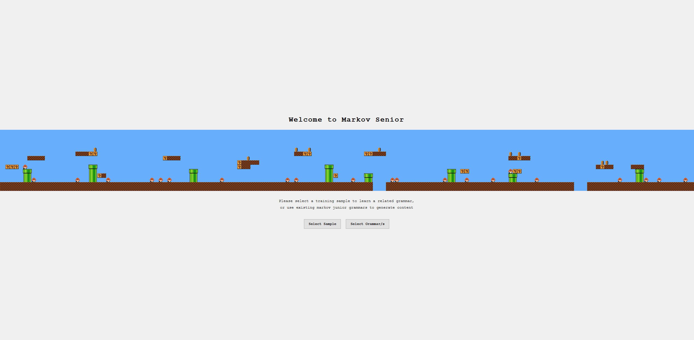

# Markov Senior Web GUI

A small vanilla JavaScript recreation of the desktop GUI from
[ADockhorn/MarkovSenior](https://github.com/ADockhorn/MarkovSenior), a research tool
that learns MarkovJunior grammars from Super Mario Bros. levels and evolves new
levels segment by segment.

